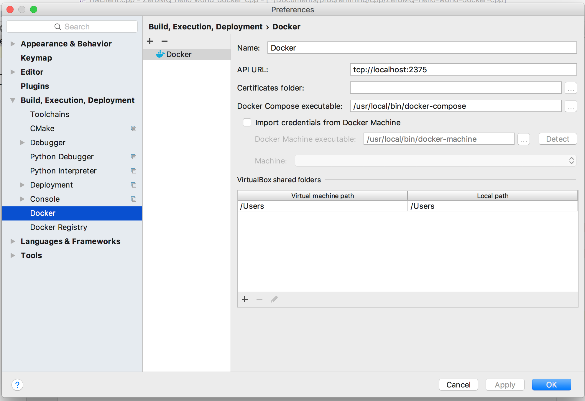
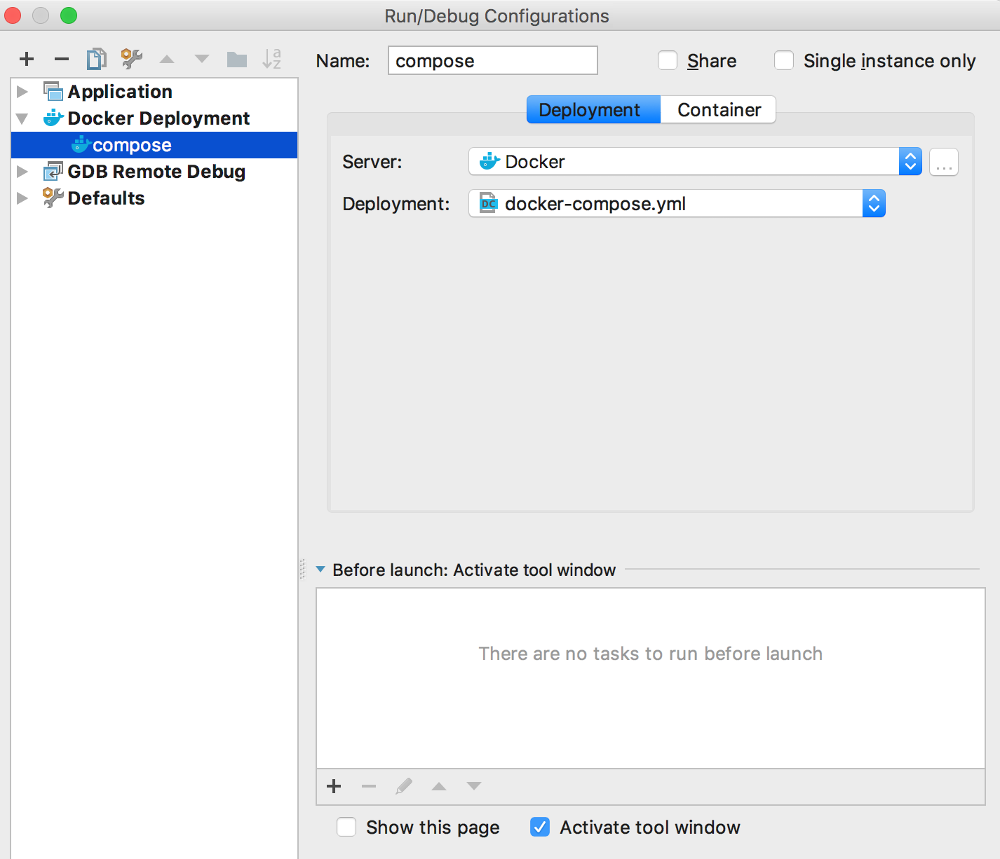
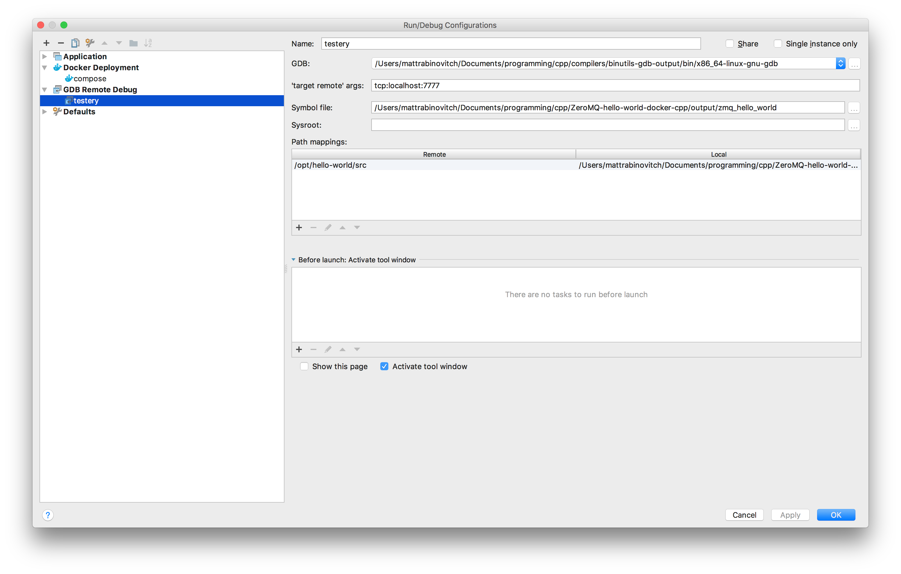

# Configuring for cpp development and debugging

## configuration for docker

#### 1. Run socat command
for docker to work nicely with clion, we need to use socat. Adding this to your bash_profile will make it easy to call the command anytime.

```
alias docker-bridge="socat TCP-LISTEN:2375,reuseaddr,fork,bind=localhost UNIX-CONNECT:/var/run/docker.sock"
```

call `docker-bridge` to run socat command

#### 2. configure clion to connect to docker
Install the docker plugin for clion, then set the configurations to match this picture:



#### 3. configure clion to build off compose
Once in a project, use the menu bar to navigate to Run > Edit Configurations. 

Use the + button to create a new debug configuration. Config should match the image below.



Now you can run this configuration which will run docker-compose up


## Configuration for GDB

GDB is a GNU project debuger. It has a configuration that allows for remote debugging. This was built for debugging on a remote machine, but easily works with debugging a container from your machine. To debug remotely, GDB server must be installed and running in the container. GDB must be compiled locally to match the GDB in the container.

#### dockerfile requirements

gdb server must be installed in the container. Add the following run command in your dockerfile

```
RUN apt-get install gdbserver -y
```

#### Docker-compose file requirements

there are a few requirements for gdb to work properly with docker. below is a sample docker-compose file configured to work with gdb remote debugging.

```
version: '2'
services:
  zmq-hello-world-client:
    build: ./zmq-hello-world-client-node
    security_opt:
      - seccomp:unconfined
    ports:
      - "7777:7777"
    volumes:
     - ./output:/opt/hello-world/debugBuild/output

```

- `security_opt`: no idea. doesn't work without it though
- `ports`: must expose port the gdb-server is running on so that a host can connect
- `volumes`: we must make the compiled binary accessible to the host machine so it can map appropriately while debugging.

#### Host machine requirements

gdb must be installed on your host machine, and it must be installed with the target set to the gdb installed on the remote machine(or container) that you're trying to debug. In most cases you will want to use the x86_64-linux-gnu as target. To install gdb, first get repo:

```
git clone git://sourceware.org/git/binutils-gdb.git -b gdb-7.11-branch --single-branch

```

 then substitute the approriate variables in the commands below, then run the commands.

```
./configure --target=x86_64-linux-gnu --with-python=<path_to_python_exc> --prefix=<install_dir>
make
make install
```

- `<path_to_python_exc>` might be something like: `/usr/local/bin/python`
- `<install_dir>` might be something like: `/absolute_path_to_this_dir/build_output`

to test that this installation has worked, and that you've configured gdb to work with the remote machine (or container) first find the path to the `x86_64-linux-gnu-gdb` executable. it's in the `bin` dir of whatever `--prefix=<install_dir>` you used in the configure command above. then run the docker-compose file. We need to test gdb with the file that is build inside the container, but accessible locally via the `volumes` mount in the docker-compose file.

once the docker-compose file has run, and you have your container up, do the following:

```bash
# go to the dir that you mounted via volume in the docker-compose file
cd ./output

# use full path of gdb to debug file in this dir
cpp/compilers/binutils-gdb-output/bin/x86_64-linux-gnu-gdb ./zmq_hello_world
```

If this worked, then it will also work with clion.

#### Clion configuration

In the top menu bar, navigate to `run > edit configurations` and add a new configuration using the `+` button at the top left of the window.

you should make your configuration look something like this:



- `GDB` should be the path to the version of gdb that you installed
- `symbol file` is the file that you have access to via volume mount (output of the container)
- `path mappings` points to src directory on the remote machine and src directory on local machine.

Now you should be good to go!

## Supporting sources

- [Clion with remote gdb debugging](http://ebagdasa.me/2017-01-20/docker-clion-debugging/)
- [docker + gdb](https://blog.jetbrains.com/clion/2016/07/clion-2016-2-eap-remote-gdb-debug/)
- [GDB server docs](https://sourceware.org/gdb/onlinedocs/gdb/Server.html)
- [Clion docker integration](https://www.jetbrains.com/help/clion/2016.3/docker-integration.html)
